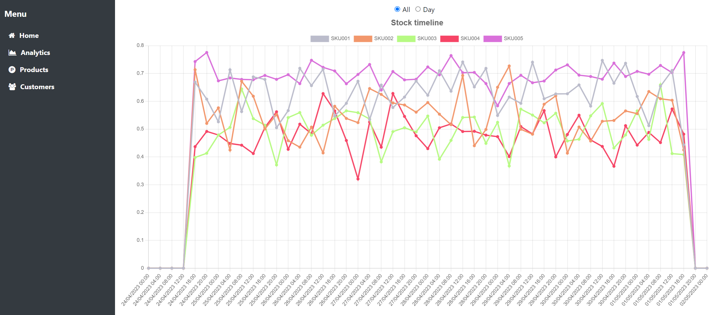

# Demo of analytics dashboard with Node.js, Express, TypeScript, MongoDB, Vue, Vue-ChartJs, Docker



Easiest way to run:
 - 1. Install Docker
 - 2. From project's root folder run command:
 ```
 docker compose up
 ```
 It will create container and images for backend, frontend. It will also import data to MongoDB from data.json file
 - 3. In browser type ``` http://localhost:4000/ping ``` for healthcheck.
 ``` http://localhost:4000/data/get ``` is the API route to get all the data
 - 4. In browser type ``` http://localhost:4001 ```. It will open Vue app.
 - 5. Navigate to http://localhost:4001/charts by clicking on 'Analytics' menu option
 
 ## Project structure:
```
|   .gitignore
|   docker-compose.yml
|   
+---back
|   |   .env
|   |   data.json
|   |   Dockerfile
|   |   package-lock.json
|   |   package.json
|   |   tsconfig.json
|   |   .dockerignore
|   |           
|   +---src
|       |   server.ts
|       |   
|       +---config
|       |       config.ts
|       |       
|       +---controllers
|       |       Data.ts
|       |       
|       +---library
|       |       Logging.ts
|       |       
|       +---models
|       |       DataRecord.ts
|       |       
|       +---routes
|               Data.ts
|               
+---front
|   |   .dockerignore
|   |   .gitignore
|   |   Dockerfile
|   |   frontend.dockerfile
|   |   index.html
|   |   package-lock.json
|   |   package.json
|   |   README.md
|   |   tsconfig.json
|   |   tsconfig.node.json
|   |   vite.config.ts
|   |   
|   +---.vscode
|   |       extensions.json
|   |       
|   +---dist
|   |   |   index.html
|   |   |   vite.svg
|   |   |   
|   |   +---assets
|   |           fontawesome-webfont-2adefcbc.woff2
|   |           fontawesome-webfont-7bfcab6d.eot
|   |           fontawesome-webfont-aa58f33f.ttf
|   |           fontawesome-webfont-ad615792.svg
|   |           fontawesome-webfont-ba0c59de.woff
|   |           index-2748fbfe.js
|   |           index-7fd564d1.css
|   |                   
|   +---public
|   |       vite.svg
|   |       
|   +---src
|       |   App.vue
|       |   eventBus.ts
|       |   main.ts
|       |   router.ts
|       |   style.css
|       |   vite-env.d.ts
|       |   
|       +---assets
|       |   |   products.ts
|       |   |   vue.svg
|       |   |   
|       |   +---fonts
|       |       +---font-awesome-4.7.0
|       |           |   HELP-US-OUT.txt
|       |           |   
|       |           +---css
|       |           |       font-awesome.css
|       |           |       font-awesome.min.css
|       |           |       
|       |           +---fonts
|       |           |       fontawesome-webfont.eot
|       |           |       fontawesome-webfont.svg
|       |           |       fontawesome-webfont.ttf
|       |           |       fontawesome-webfont.woff
|       |           |       fontawesome-webfont.woff2
|       |           |       FontAwesome.otf
|       |           |       
|       |           +---less
|       |           |       animated.less
|       |           |       bordered-pulled.less
|       |           |       core.less
|       |           |       fixed-width.less
|       |           |       font-awesome.less
|       |           |       icons.less
|       |           |       larger.less
|       |           |       list.less
|       |           |       mixins.less
|       |           |       path.less
|       |           |       rotated-flipped.less
|       |           |       screen-reader.less
|       |           |       stacked.less
|       |           |       variables.less
|       |           |       
|       |           +---scss
|       |                   font-awesome.scss
|       |                   _animated.scss
|       |                   _bordered-pulled.scss
|       |                   _core.scss
|       |                   _fixed-width.scss
|       |                   _icons.scss
|       |                   _larger.scss
|       |                   _list.scss
|       |                   _mixins.scss
|       |                   _path.scss
|       |                   _rotated-flipped.scss
|       |                   _screen-reader.scss
|       |                   _stacked.scss
|       |                   _variables.scss
|       |                   
|       +---components
|               AnalyticsComponent.vue
|               CustomersComponent.vue
|               HomeComponent.vue
|               MenuComponent.vue
|               OOSComponent.vue
|               ProductsComponent.vue
|               StockTimelineComponent.vue
|               
+---mongo-seed
        data.json
        Dockerfile
```        
